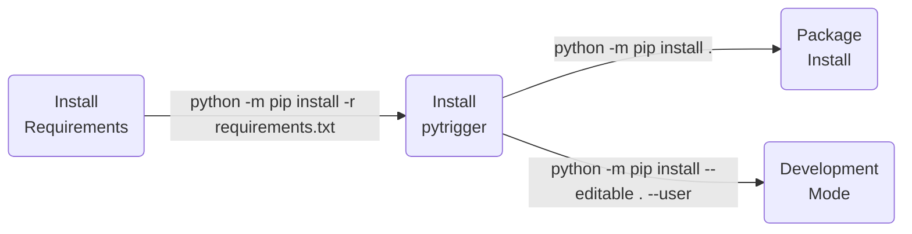

<p align="center">
    
  <br>
  <b>
    Unibo - Alma Mater Studiorum
  </b>
</p>

| **Authors**                                   | **Project**      |
|:---------------------------------------------:|:----------------:|
| [**N. Curti**](https://github.com/Nico-Curti) | **pytrigger**    |

# pyTrigger - Python package

Python interface for the analysis and management of LongCLAVIS EU Trigger datasets.

* [Overview](#overview)
* [Prerequisites](#prerequisites)
* [Installation](#installation)
* [Usage](#usage)
* [Testing](#testing)
* [Table of contents](#table-of-contents)
* [Contribution](#contribution)
* [References](#references)
* [Authors](#authors)
* [License](#license)
* [Acknowledgments](#acknowledgments)
* [Citation](#citation)

## Overview

The access to the online database is performed one-for-all at the first import of the library.
During the first creation of the `TriggerDB` object, the programm will ask you to insert your *email* and *password*, saving them into a secure way into your machine.
The location of these information is restricted and the edit of these files must be performed carefully!

For sake of completeness, the location of the account information is set to `$HOME/.config/pytrigger`, split into the following files:

```bash
$HOME/.config/pytrigger/credentials.json # encrypted credentials
$HOME/.config/pytrigger/secret.key # encryption key
```

## Prerequisites

The complete list of requirements for the `pytrigger` package is reported in the [requirements.txt](https://github.com/Nico-Curti/pytrigger/blob/main/requirements.txt)

## Installation

Python version supported : 

The `Python` installation for *developers* is executed using [`setup.py`](https://github.com/Nico-Curti/pytrigger/blob/main/setup.py) script.



## Usage

You can use the `pytrigger` library into your Python scripts or directly via command line.

### Command Line Interface

The `pytrigger` package could be easily used via command line (after installing the library!) by simply calling the `pytrigger` program.

The full list of available flags for the customization of the command line could be obtained by calling:

```bash
$ trigger --help
usage: trigger [-h] --table TABLE [--select SELECT [SELECT ...]] [--where WHERE [WHERE ...]] [--orderby ORDERBY] [--order {ASC,DESC}] [--limit LIMIT] [--version]

Python package for the TRIGGER EU Project analysis.

optional arguments:
  -h, --help            show this help message and exit
  --table TABLE, -t TABLE
                        Name of the table to use for the query
  --select SELECT [SELECT ...], -s SELECT [SELECT ...]
                        List of column names to select in the query
  --where WHERE [WHERE ...], -w WHERE [WHERE ...]
                        List of condition to apply in the filtering
  --orderby ORDERBY, -b ORDERBY
                        Name of the column to use for the ordering of the results
  --order {ASC,DESC}, -o {ASC,DESC}
                        Order of the result
  --limit LIMIT, -l LIMIT
                        Maximum number of records to retrieve from the request
  --version, -v         Get the current version installed
```

### Python script

The `pytrigger` package provides a simple interface to the online database for the management of the query.
The query management could be performed following a "standard" interface or a "chaining" one.

A simple example of the standard interface is given by the following code:

```python
from trigger import TriggerDB

with TriggerDB() as db:
  res = db.select(
    table='myair',
    columns=['year', 'month'],
    where={
      'year': '=2025', 
      'month': '=9', 
      'day': '=10', 
      'hour': '>=0', 
      'email': '=DE000086'
    },
    order_by='month',
    order='ASC',
  )
```

The equivalent "chaining" interface is given by the following code:

```python
from trigger import TriggerDB

with TriggerDB() as db:
  res = (
    db.from_('myair')
      .select('year', 'month')
      .where(year='=2025', month='=9', day='=10', hour='>=0', email='=DE000086')
      .order_by('month')
      .asc()
      .fetch()
  )
```

## Testing

A full set of testing functions is provided in the [test](https://github.com/Nico-Curti/pytrigger/blob/main/test) directory.

The tests are performed using the [`pytest`](https://github.com/pytest-dev/pytest/) Python package.
You can run the full list of tests with:

```bash
python -m pytest ./test/ --cov=pytrigger --cov-config=.coveragerc
```

in the project root directory.

The continuous integration using `github-actions` tests each function in every commit, thus pay attention to the status badges before use this package or use the latest stable version available.

## Table of contents

Description of the folders related to the `Python` version.

| **Directory**                                                                        |  **Description**                                                             |
|:-------------------------------------------------------------------------------------|:-----------------------------------------------------------------------------|
| [trigger](https://github.com/Nico-Curti/pytrigger/blob/main/trigger)                 | List of `Python` scripts for `trigger` database management and analysis.     |
| [examples](https://github.com/Nico-Curti/pytrigger/blob/main/docs/source/examples)   | List of `Python` examples as Jupyter Notebook.                               |

## Contribution

| :triangular_flag_on_post: Note |
|:-------------------------------|
| The following files are missing an they must be inserted/updated according to your needs/projects |

Any contribution is more than welcome :heart:. Just fill an [issue](https://github.com/Nico-Curti/pytrigger/blob/main/.github/ISSUE_TEMPLATE/ISSUE_TEMPLATE.md) or a [pull request](https://github.com/Nico-Curti/pytrigger/blob/main/.github/PULL_REQUEST_TEMPLATE/PULL_REQUEST_TEMPLATE.md) and we will check ASAP!

See [here](https://github.com/Nico-Curti/pytrigger/blob/main/.github/CONTRIBUTING.md) for further informations about how to contribute with this project.

## References

<blockquote>1- Author et al, "Title", Journal, Year </blockquote>

## Authors

*  [](https://github.com/Nico-Curti) [](https://www.unibo.it/sitoweb/nico.curti2) **Nico Curti**

See also the list of [contributors](https://github.com/Nico-Curti/pytrigger/contributors) [](https://github.com/Nico-Curti/pytrigger/graphs/contributors/) who participated in this project.

## License

The `pytrigger` package is licensed under the GPLv2 [License](https://github.com/Nico-Curti/pytrigger/blob/main/LICENSE).

## Acknowledgments

Thanks goes to all contributors of this project.

## Citation

If you have found `pytrigger` helpful in your research, please consider citing the original repository

```BibTeX
@misc{pytrigger,
  author = {Curti, Nico},
  title = {pytrigger - Python package for the TRIGGER EU Project analysis},
  year = {2025},
  publisher = {GitHub},
  howpublished = {\url{https://github.com/Nico-Curti/pytrigger}}
}
```